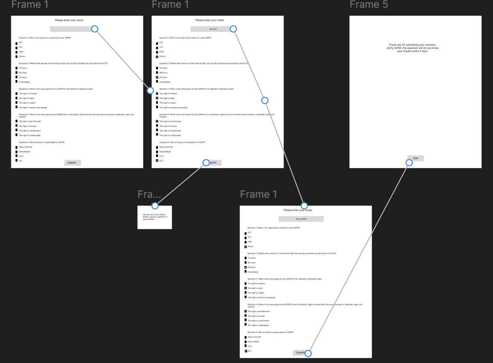
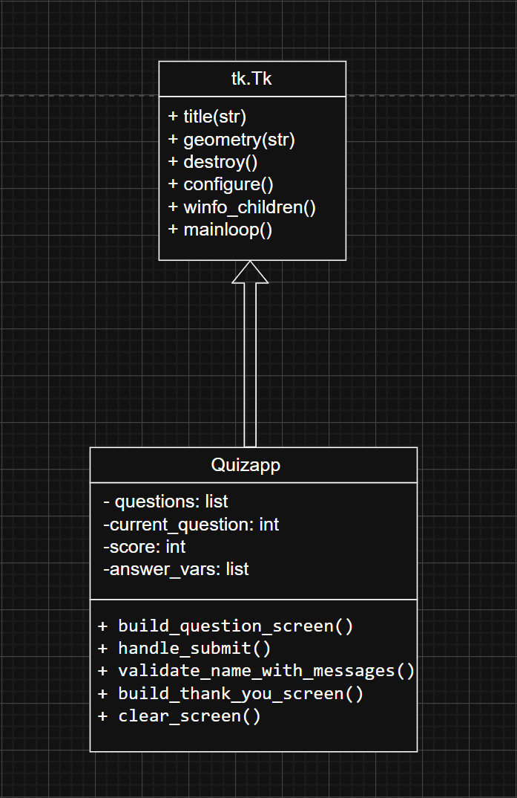

# quiz_app_summative2

## Introduction

My project is a GDPR quiz app for smaller technology companies, like mine. It can be used to run knowledge checks, for example, it might be taken when someone joins the business or just periodically to maintain standards. As I work in consulting, staff are required to periodically complete assessments to demonstrate competency in areas such as policy awareness and procedural knowledge. This process isn’t currently standardised for all staff as we are still a small-scale company however, my app brings consistency, saves time, and removes manual effort. This will be important as the company scales and the data can be used for performance analytics. 

Built in Python using the tkinter GUI library, the app can be launched on company machines, where employees enter their name, answer a series of multiple-choice GDPR questions, and submit their answers. It provides a lightweight, accessible, desktop-based quiz tool.

The MVP is focused on the core user journey.This makes the app easy to deploy without any server infrastructure, database configuration, or external dependencies beyond the Python standard library. It is a first step toward a more scalable internal assessment platform. The modular design of the codebase, separating data loading, input validation, and the GUI into clear files, also means the application can be extended incrementally. For example, you could add functionality like automatic scoring or an admin dashboard as it grows atop the existing code.


## Design

**GUI Design**
The application follows a simple, linear user journey across two screens. The first is the quiz screen, where a name entry field sits at the top prompts the user to enter their name before they begin. Below it, each question is displayed with four radio button options beneath it, and a single submit button is at the bottom to submit all answers. The second screen is the thank you screen, which appears after a successful submission. It confirms the employee's name and lets them know the assessor will be in touch with their results. A Quit button closes the application.



The planned user journey is as follows: 
1. The user launches the app
2. Enters their name
3. Reads and answers each multiple-choice question
4. Then clicks submit 
5. The name is validated and if anything is wrong an error pop-up explains what needs to be fixed. 
6. On a successful submission, the thank you screen appears and the record is saved to CSV. 
7. The user then quits the application.

**Functional and Non-Functional Requirements**

The functional requirements describe what the application must do: 
The app must display a name entry field and load its questions dynamically from a CSV file. 
Each question must present radio button options. 
Before saving, the app must validate the entered name 
On a valid submission, it writes the employee's details and their answers to `employee_records.csv`.
Display a thank you confirmation screen and quit button.

The non-functional requirements describe how the application should perform:
It must run on any machine with Python 3 installed without dependencies.
The interface must be legible, with accessible contrast levels.
Name validation errors must be communicated clearly via pop-up dialog boxes. 
The app must append to the CSV rather than overwrite it, so that previous records aren't lost. 

**Tech Stack**
- The entire application is built using Python 3 and relies only on its standard library.
- The GUI is built with tkinter. 
- Questions are stored in and loaded from a CSV file and results are written back to a separate CSV file in the same way. 
- Name validation uses the re module to check for digits, and timestamps are generated using the datetime module. 
- Testing is handled with the built-in unittest framework.

**Code Design**
The application logic is split across three Python files: `main.py`, `quiz_data.py`, and `quiz_utility.py`. The project folder also contains `questions.csv` as the question bank, `test_quiz.py` for the automated tests, and `employee_records.csv` which is generated automatically when the first submission is made.



```
quiz_app_summative2/
├── main.py                # Main GUI application
├── quiz_data.py           # Question loading logic
├── quiz_utils.py          # Name validation utilities
├── questions.csv          # Question bank
├── student_records.csv    # Auto-generated results file
└── test_quiz.py           # Automated unit tests
```

The Quizapp class in `main.py` is the core of the application and contains the following methods: `__init__()` sets up the window, name entry field, and answer variables, and calls `build_question_screen()` to render the questions. `build_question_screen()` renders all questions and radio buttons from the loaded question data. `handle_submit()` validates the name, collects the answers, writes to CSV, and shows the thank you screen. `build_thank_you_screen()` clears the screen and renders the confirmation message. `validate_name_with_messages()` calls the functions from `quiz_utils.py` and shows error dialogs if anything fails. `clear_screen()` destroys all screen elements in the window to allow the screen to transition.
`quiz_data.py` contains a single function, `load_questions()`, which reads questions.csv and returns a list of question dictionaries. `quiz_utils.py` contains four pure functions: `clean_name()`, `presence_check()`, `length_check()`, and `character_check()`.

## Development

The application is built around a single class, QuizApp, which extends `tk.Tk` and manages the entire lifecycle of the GUI. The three modules each have a distinct responsibility, which kept the code easier to read and navigate. For example, if a future developer needed to change the validation rules they would know to look directly in `quiz_utility.py`.

**Loading Questions: quiz_data.py**

```python
import csv # for reading the CSV file

def load_questions(filepath="questions.csv"):
    
    questions = []

    with open(filepath, newline="", encoding="utf-8") as csvfile:
        reader = csv.DictReader(csvfile)
        for row in reader:
            questions.append({
                "question": row["question"],
                "options": [
                    row["option_a"],
                    row["option_b"],
                    row["option_c"],
                    row["option_d"],
                ],
                "correct": int(row["correct"]) - 1
            })

    return questions
```

`load_questions` reads `questions.csv` using `csv.DictReader`, which maps each row to a dictionary keyed by the column header names. Each question is stored as a dictionary containing the question text, a list of four options, and the index of the correct answer. The correct answer is converted from 1-based in the CSV to 0-based in Python by subtracting 1, so that it matches the way the radio button option values are indexed. This list of dictionaries is passed directly into the QuizApp constructor, keeping the data loading completely separate from the GUI.

**Input Validation: quiz_utils.py**

```python
import re 

def clean_name(name):
    return name.strip().title()

def presence_check(name: str) -> bool:
    return bool(name)

def length_check(name: str) -> bool:
    return 2 <= len(name) <= 50

def character_check(name: str) -> bool:
    return not re.search(r"\d", name)
```

All four functions are pure functions, meaning they depend only on their input and produce no side effects. `clean_name` removes any leading or trailing whitespace and converts the name to title case before any validation happens. The three check functions each enforce one rule: whether the name exists, whether it is within the accepted length, and whether it contains any digits. Keeping each rule in its own function made them straightforward to test individually in `test_quiz.py`.

**Building the Quiz Screen: build_question_screen()**

```python
def build_question_screen(self):
    question_number = 1

    for question in self.questions:
        q_label = tk.Label(
            self,
            text=f"Question {question_number}. {question['question']}",
            font=("Arial", 18),
            wraplength=500,
            justify="center",  
            bg = BG
        )
        q_label.pack(anchor="w", padx=40, pady=(20, 5))

        answer_var = tk.IntVar(value=-1)
        self.answer_vars.append(answer_var)

        option_value = 0
        for option in question["options"]:
            rb = tk.Radiobutton(
                self,
                text=option,
                variable=answer_var,
                value=option_value,
                font=("Arial", 14),
                bg=BG
            )
            rb.pack(anchor="w", padx=60)
            option_value += 1

        question_number += 1
```

This method loops over `self.questions` and dynamically creates the screen elements for each question. For every question, it creates a Label to display the question text and four Radiobutton elements for the options. Each question gets its own `tk.IntVar` to track which option the user has selected, initialised to -1 to indicate that nothing has been chosen yet. These are stored in `self.answer_vars` so they can be read later when the user submits.

**Handling Submission: handle_submit()**

```python
def handle_submit(self):
    
    st_name = clean_name(self.name_entry.get())
    timestamp = datetime.now().strftime("%Y-%m-%d %H:%M:%S")

    if self.validate_name_with_messages(st_name):

        answers = []
        for var in self.answer_vars:
            answers.append(var.get())
                
        with open("employee_records.csv", mode="a", newline="", encoding="utf-8") as file:
            writer = csv.writer(file)
            writer.writerow([st_name, timestamp, answers])

        self.build_thank_you_screen(st_name)
```

When the user clicks submit, the app first cleans the entered name using `clean_name` and generates a timestamp. It then runs the name through `validate_name_with_messages`. If validation passes, it loops through `self.answer_vars` to collect each selected answer index and writes a single row to `employee_records.csv` containing the name, timestamp, and answers. The file is opened in append mode so that previous submissions are never overwritten. Once the row is saved, the app calls `build_thank_you_screen` to transition to the final screen.


## Testing

**Testing Strategy and Methodology**
My testing for this application combines manual testing and automated unit testing to cover both the GUI behaviour and the underlying logic functions.

I used manual testing to verify the full user journey through the GUI, checking the rendering of widgets, error dialogs, and screen transitions by running the application directly.

I also did automated unit testing using Python's built-in unittest framework. I wrote unit tests for the pure utility functions in `quiz_utility.py` and the data loading function in `quiz_data.py`. 

**Manual Test Outcomes**

App launches successfully 
- Running python `main.py` was expected to open the window with the name field and all questions visible. 
- The window opened as expected.

Name field accepts valid input 
- Entering "Helen Test" and clicking submit was expected to show the thank you screen with no errors. 
- It behaved as expected.

Empty, too short or with numbers name is rejected 
- Leaving the name field blank, entering "A" and "Alice31" and clicking submit was expected to show a pop-up.
- The dialog appeared correctly. 

Answers are recorded in the CSV 
- Submitting a valid name and answers was expected to append a row to `employee_records.csv`. 
- The row was written correctly. 

Multiple submissions append rather than overwrite
- Submitting twice with different names was expected to result in both rows being present in the CSV. 
- Both rows were present. 

Thank you screen displays the user's name 
- Submitting as "Helen" was expected to show "Helen, the assessor will let you know your results soon!" 
- The name displayed correctly.

Quit button closes the application
- Clicking quit on the thank you screen was expected to close the window. 
- It closed as expected.

Questions load and render from the CSV 
- With `questions.csv` present, running the app was expected to display all questions and options. 
- All questions loaded and displayed correctly. 

**Unit Test Outcomes**

```python
import unittest # a testing framework
from quiz_data import load_questions # converts to dict
from quiz_utils import clean_name # cleans the name
from quiz_utils import character_check # validates the name


class TestSmoke(unittest.TestCase):

    def test_load_questions_runs(self):
        self.assertTrue(1)

class TestQuiz(unittest.TestCase):

    def test_load_questions_runs(self):
        questions = load_questions()
        self.assertIsNotNone(questions)
        
    def test_clean_name(self):
        self.assertEqual(clean_name("  jenny smith  "), "Jenny Smith")
        self.assertEqual(clean_name("ALEX CHAPMAN"), "Alex Chapman")
        
    def test_character_check_happy(self):
        self.assertTrue(character_check("Alice"))
        self.assertTrue(character_check("Alice Bridgerton"))

    def test_character_check_unhappy(self):
        self.assertFalse(character_check("Alice21"))
        self.assertFalse(character_check("4404"))

if __name__ == "__main__":
    unittest.main()
```

The test file contains five tests across two classes. `TestSmoke` contains a single test that simply asserts True to confirm the test runner is working. `TestQuiz` contains four tests: one that checks `load_questions` returns a result that is not None, one that checks `clean_name` correctly strips whitespace and applies title case, and two that check `character_check` returns True for valid names and False for names containing numbers. All five tests pass.


## Documentation

**User Documentation**
How to Launch the App
1.	Ensure Python 3 is installed on your machine. You can verify this by running python --version in your terminal.
2.	Download or clone this repository to your computer.
3.	Ensure questions.csv is in the same folder as `main.py`.
4.	Open a terminal, navigate to the project folder, and run: 

```
python main.py
```

How to Use the Quiz
1.	When the application opens, type your full name into the text field at the top.
2.	Read each question and select your answer by clicking the appropriate radio button.
3.	When you have answered all questions, click the Submit button.
4.	If your name is invalid a pop-up message will guide you
5.	Once submitted, a confirmation screen will display
6.	Click Quit to close the application.

Notes for Quiz Assessors

The submitted results are saved automatically to a file called `employee_records.csv`. Each row contains the employee's name, date and time of submission, and their selected answer indices . This file can be opened in Excel to review responses.

**Technical Documentation**
Project Structure
```
quiz_app_summative2/
main.py              # Main GUI application
quiz_data.py         # Question loading logic
quiz_utils.py        # Name validation 
```

questions.csv Format

The file must include the following columns:
question, option_a, option_b, option_c, option_d, correct
Question text, Option A, Option B, Option C, Option D, 1–4 (1 = option_a)

Running Tests Locally

```bash
python -m unittest test_quiz.py -v
```

**Key Design Decisions**

- All validation logic is kept in `quiz_utility.py` as pure functions so they can be tested independently of the GUI.
- `load_questions` is noted in the docstring as an impure function, since its output depends on the contents of an external file.
- The `employee_records.csv` file is opened in append mode ("a") to ensure no data is lost between sessions.
- `tk.IntVar` is initialised to -1 for each question to distinguish unanswered questions from a valid selection of index 0.


## Evaluation

Overall, I think the development of this project went well for a minimum viable product, but I acknowledge there are still limitations. 

My decision to have modular code (separated into `main.py`, `quiz_data.py`, and `quiz_utils.py`) meant the code was easier to work with and the utility functions could be unit tested without any dependency on the GUI.

Writing pure functions for validation was another strength, the tests for `clean_name` and `character_check` ensured confidence that edge cases like names in all caps or names containing numbers were handled correctly.

My use of tkinter was appropriate for an MVP however, I used tkinter ‘pack’ to position widgets on screen which simply stacks widgets one after another from top to bottom. This worked for my basic application, but as more questions and radio buttons are added, this may become harder to manage. In future I would use grid instead as it allows you to position widgets in specific rows and columns.

There are several areas that could be improved in a future iteration of this application. One of most significant limitation of the current implementation is that the final screen does not display the employee's score. The correct index is stored in each question dictionary loaded from the CSV, but the submission logic does not compare selected answers against correct answers at any point. I think this would add significant value for both the employee and the assessor.

Finally, the employee_records.csv output stores answers as a Python list representation which is not ideal for an assessor reviewing results in Excel. A future improvement would be to store the option text rather than its index, this would make the output more readable. 

During this project my key learning was that tkinter widgets don’t scroll by default. I know now that if I wanted more questions I’d need to explicitly set up scrolling as this is vital to usability.

Despite these limitations, the MVP successfully delivers on its core purpose: a deployable, dependency-free desktop quiz tool that captures employee responses reliably and stores them for assessor review.
